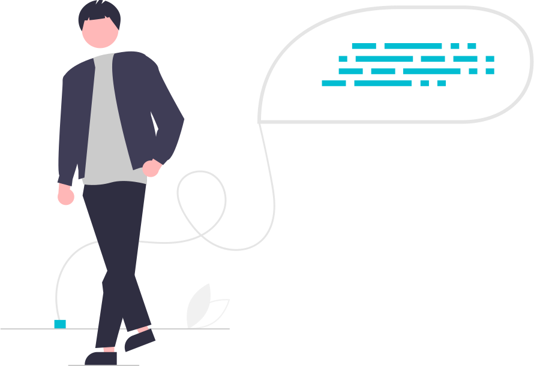

<!--
**NDRBAX/NDRBAX** is a ✨ _special_ ✨ repository because its `README.md` (this file) appears on your GitHub profile.

Here are some ideas to get you started:

- 🔭 I’m currently working on ...
- 🌱 I’m currently learning ...
- 👯 I’m looking to collaborate on ...
- 🤔 I’m looking for help with ...
- 💬 Ask me about ...
- 📫 How to reach me: ...
- 😄 Pronouns: ...
- ⚡ Fun fact: ...
-->

    
    <h1 align="center">Hi , I'm NDRBAX</h1>
    

        
        
    

    <h3 align="center">I'm learning to become Full Stack Developer !</h3>

| | |
|:-------------------------:|:-------------------------:|
|<ul style="list-style: none; align: right"><li>🔭 I’m currently learning on <a href="https://www.theodinproject.com/">The Odin Project</a></li><li>👯 I’m looking to collaborate on <strong>OpenSource Projects</strong></li><li>👨‍💻 All of my projects are available at <a href="https://github.com/NDRBAX">My GitHub Portfolio</a></li></ul>||
||
<b>Note:</b> Top languages is only a metric of the languages my public code consists of and doesn't reflect experience or skill level.
|
|||

<h3 style="margin:20px 0 20px 0" align="center">Languages and Tools</h3>

